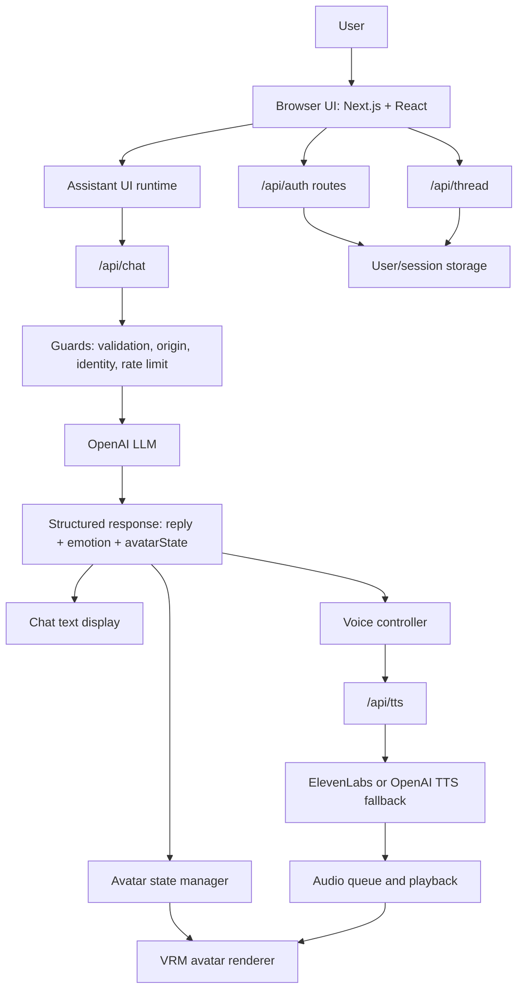
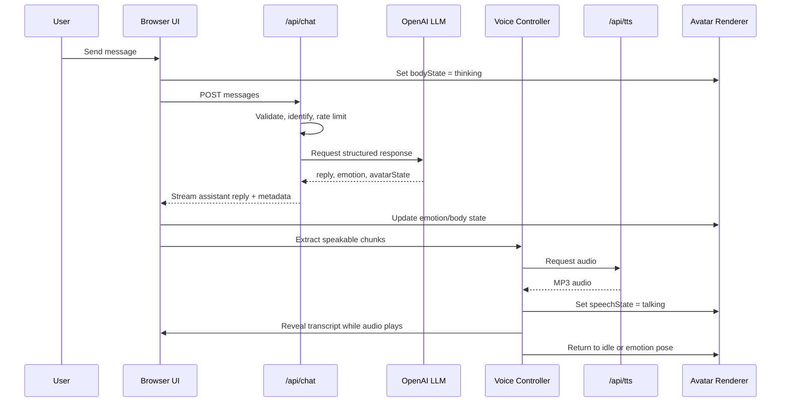
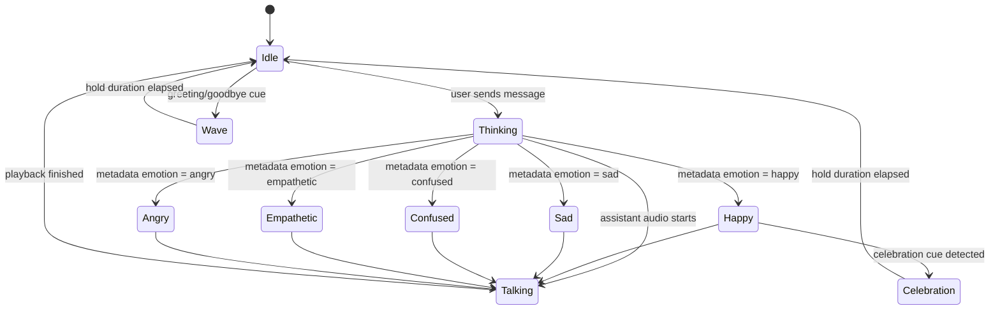
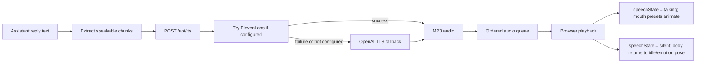
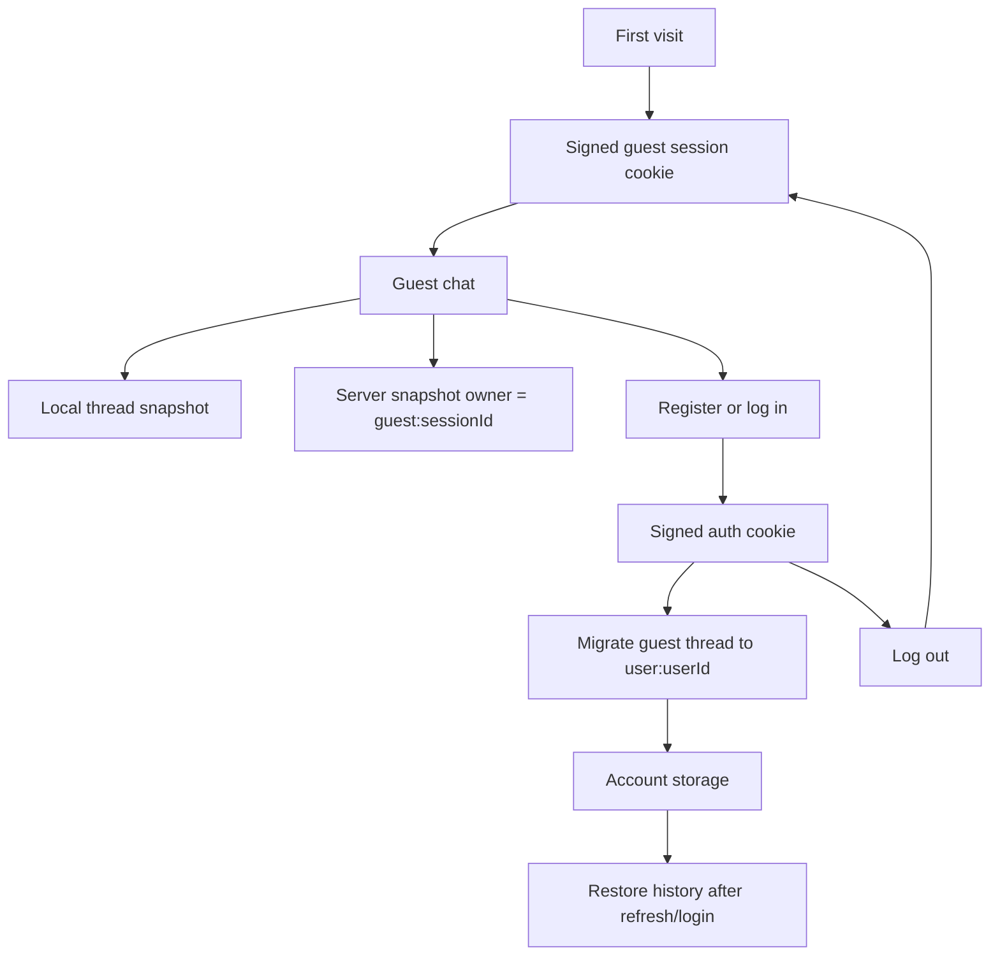
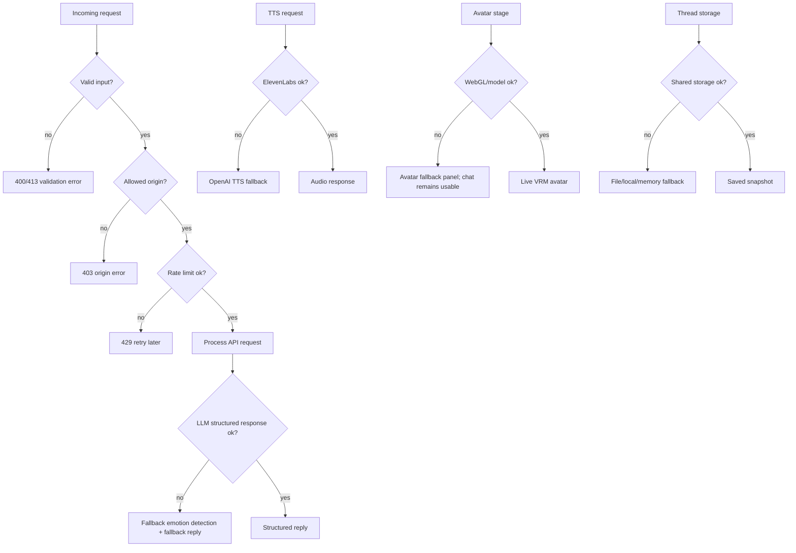

# Architecture and Implementation Evidence

This document collects code-supported evidence for the dissertation. It frames the project as a lightweight expressive conversational avatar interface for LLM interaction, not simply as a chatbot with a character.

## Refined Project Purpose

### Aim

The aim of this project is to design, implement, and evaluate a lightweight web-based expressive avatar interface for LLM-powered chat interaction. The system investigates whether structured LLM response metadata can be mapped to a 3D avatar's visual, speech, and interaction states in order to make chatbot interaction more engaging, natural, and visually communicative.

### Research Question

To what extent can a lightweight expressive avatar interface improve the perceived engagement, naturalness, and usability of interaction with an LLM-based chatbot?

### Sub-Research Questions

1. How can an LLM response be structured so that it controls both conversational text and avatar behaviour?
2. Which avatar states are sufficient for a lightweight but expressive web-based conversational interface?
3. How can speech output, text display, and avatar mouth movement be coordinated without full phoneme-level lip-sync?
4. How robust is the system when evaluated through requirements testing, scenario testing, inspection-based usability evaluation, accessibility checks, fallback testing, and performance measurement?

### Academic Contribution

The academic contribution is a practical demonstration of a lightweight state-based approach to expressive LLM interaction. Instead of attempting full emotional intelligence, camera-based emotion detection, motion capture, or phoneme-perfect lip-sync, the project applies a controlled architecture where the LLM returns reply text plus metadata for emotion and avatar state. This metadata is then mapped to visible avatar behaviour and speech playback in the browser.

### Technical Contribution

The technical contribution is a full-stack web implementation that connects Assistant UI, a structured LLM response API, text-to-speech, VRM avatar rendering, state-based animation, user preferences, authentication, and conversation persistence. The implementation demonstrates how expressive multimodal feedback can be added to an LLM chatbot without requiring a heavyweight digital-human pipeline.

### Scope

The project includes LLM-based chat, structured response metadata, 3D VRM avatar rendering, procedural avatar movement, text-to-speech playback, avatar state mapping, preferences, guest access, authentication, conversation persistence, dashboard features, fallback behaviour, and automated tests.

### Deliberately Out Of Scope

The project does not attempt motion capture, camera emotion detection, biometric emotion recognition, full emotional intelligence, speech-to-speech real-time conversation, production-scale moderation, professional mental-health support, or phoneme-level lip-sync. These features would require a much larger technical and ethical scope than is appropriate for this final-year project.

## Repository Structure

```text
fyp-avatar/
|-- app/
|   |-- page.tsx
|   |-- assistant.tsx
|   |-- layout.tsx
|   `-- api/
|       |-- chat/route.ts
|       |-- tts/route.ts
|       |-- thread/route.ts
|       |-- auth/
|       `-- admin/visitors/route.ts
|-- components/
|   |-- assistant-ui/
|   |-- avatar/
|   |-- auth/
|   |-- dashboard/
|   |-- preferences/
|   |-- scene/
|   `-- ui/
|-- lib/
|   |-- server/
|   |-- tts/
|   |-- avatar-state.ts
|   |-- avatar-catalog.ts
|   |-- chat-response.ts
|   |-- preferences.ts
|   `-- thread-persistence.ts
|-- public/models/
|-- tests/
|   |-- server/
|   |-- lib/
|   `-- e2e/
|-- report-screenshots/
|-- artifacts/
|-- package.json
|-- playwright.config.ts
|-- next.config.ts
|-- tsconfig.json
`-- biome.json
```

## Major Folder and Module Roles

| Area | Main files | Purpose |
|---|---|---|
| App shell | `app/page.tsx`, `app/assistant.tsx`, `app/layout.tsx` | Creates the main page, global layout, assistant runtime, avatar/chat layout, status indicators, dashboard switch, preferences, and account controls. |
| Chat API | `app/api/chat/route.ts`, `lib/chat-response.ts` | Validates messages, applies guards and rate limits, calls OpenAI, asks for structured response metadata, streams the assistant reply, and attaches emotion/avatar metadata. |
| Avatar rendering | `components/ui/avatar-canvas.tsx`, `lib/avatar-state.ts`, `lib/avatar-catalog.ts` | Loads VRM models, renders the Three.js scene, maps emotion/body/speech state to procedural facial, body, blink, idle, and mouth movement. |
| Voice and TTS | `app/api/tts/route.ts`, `components/assistant-ui/thread-voice-controller.tsx`, `lib/tts/*` | Converts assistant text to audio, uses ElevenLabs when configured and OpenAI fallback, chunks text, queues audio, reveals transcript text, and drives talking state. |
| Persistence | `components/assistant-ui/persistent-thread.tsx`, `app/api/thread/route.ts`, `lib/server/thread-store.ts`, `lib/thread-persistence.ts` | Saves, restores, deletes, and migrates thread snapshots using local storage and server storage. |
| Authentication | `components/auth/account-controls.tsx`, `app/api/auth/*`, `lib/server/auth.ts`, `lib/server/session.ts`, `lib/server/user-store.ts` | Supports guest sessions, registration, login, logout, signed cookies, password hashing, and account-level thread identity. |
| Preferences | `components/preferences/preferences-dialog.tsx`, `lib/preferences.ts` | Stores voice, avatar visibility, reduced motion, compact layout, and avatar ID preferences in local storage. |
| Dashboard/admin | `components/dashboard/user-dashboard.tsx`, `app/api/admin/visitors/route.ts`, `lib/server/visitor-store.ts` | Shows account/avatar state and admin-only visitor records. |
| Tests | `tests/server/*`, `tests/lib/*`, `tests/e2e/*` | Covers API helpers, auth/session, stores, preferences, thread persistence, and Playwright flows for preferences and auth persistence. |
| Assets | `public/models/*.vrm` | VRM avatar models used by the avatar catalog and renderer. |

## Important Files To Cite In Chapter 4

| Evidence area | File path |
|---|---|
| Main app shell and state coordination | `app/assistant.tsx` |
| Chat route and structured response | `app/api/chat/route.ts` |
| Chat metadata types and normalisation | `lib/chat-response.ts` |
| Avatar state definitions and mapping | `lib/avatar-state.ts` |
| Avatar catalog | `lib/avatar-catalog.ts` |
| VRM renderer and procedural animation | `components/ui/avatar-canvas.tsx` |
| Voice controller, chunking, queueing, avatar speech state | `components/assistant-ui/thread-voice-controller.tsx` |
| TTS server route and provider fallback | `app/api/tts/route.ts` |
| TTS helpers | `lib/tts/extract-speakable-chunks.ts`, `lib/tts/request-tts.ts`, `lib/tts/word-reveal.ts` |
| Persistent thread client logic | `components/assistant-ui/persistent-thread.tsx` |
| Thread API | `app/api/thread/route.ts` |
| Thread storage backend | `lib/server/thread-store.ts` |
| Auth/session security | `lib/server/auth.ts`, `lib/server/session.ts` |
| User storage and password hashing | `lib/server/user-store.ts` |
| API protection and rate limiting | `lib/server/api.ts` |
| Preferences/accessibility controls | `components/preferences/preferences-dialog.tsx`, `lib/preferences.ts` |
| Dashboard and admin route | `components/dashboard/user-dashboard.tsx`, `app/api/admin/visitors/route.ts` |

## End-To-End System Explanation

The user interacts with the React/Next.js browser interface. The Assistant UI runtime sends user messages to `/api/chat`. The chat route validates the request, resolves guest or authenticated identity, checks the allowed origin, applies rate limits, trims message context, and sends the prompt to the OpenAI model. The route asks the model to return a structured object containing `reply`, `emotion`, and `avatarState`. The reply is streamed back to the chat panel, while the metadata is attached to the assistant message.

On the client, the voice controller reads assistant message text and metadata. It updates emotion/body state, splits speakable text into chunks, sends those chunks to `/api/tts`, queues returned audio, and switches the avatar speech state to `talking` during playback. The avatar renderer receives emotion, body, and speech state props and maps them to VRM expressions, body pose offsets, blinking, idle movement, and procedural mouth presets. Conversations are saved through a local snapshot and the `/api/thread` route, with guest identity based on signed session cookies and account identity based on signed auth cookies.

## Mermaid Diagram 1: Overall System Architecture



## Mermaid Diagram 2: Message-To-Avatar Sequence



## Mermaid Diagram 3: Avatar State Machine



## Mermaid Diagram 4: TTS Pipeline



## Mermaid Diagram 5: Authentication and Persistence Flow



## Mermaid Diagram 6: Fallback and Error Handling



## Implementation Evidence

### A. Chat API and Structured LLM Response

File paths: `app/api/chat/route.ts`, `lib/chat-response.ts`.

The chat route is the central bridge between user input and avatar behaviour. It validates Assistant UI messages, restricts message length, trims context to a fixed budget, resolves identity, checks origin headers, applies IP and session/user rate limits, and applies a daily guest limit. The route calls OpenAI using the Vercel AI SDK and requests a structured JSON object with `emotion`, `avatarState`, and `reply`. This matters because the frontend needs more than plain text: it needs explicit metadata that can be mapped to avatar expression and body state.

Useful snippet:

```ts
const EMOTION_RESPONSE_SCHEMA = jsonSchema<StructuredChatResponse>({
  type: "object",
  properties: {
    emotion: { type: "string", enum: ["neutral", "happy", "sad", "anxious", "angry", "confused", "empathetic"] },
    avatarState: { type: "string", enum: ["idle", "thinking", "talking", "happy", "sad", "anxious", "angry", "confused", "empathetic"] },
    reply: { type: "string" },
  },
  required: ["emotion", "avatarState", "reply"],
});
```

Figure suggestion: architecture diagram showing `/api/chat` as the metadata generator. Test evidence suggestion: structured response test with screenshot of chat plus recorded metadata/log evidence.

### B. Avatar Rendering

File paths: `components/ui/avatar-canvas.tsx`, `lib/avatar-catalog.ts`.

The avatar renderer uses React Three Fiber, Three.js, Drei, and `@pixiv/three-vrm`. It loads a selected VRM model with `GLTFLoader` and `VRMLoaderPlugin`, stores humanoid bone references, and updates the avatar each frame. The renderer applies facial expressions, blinking, procedural body poses, idle motion, and mouth movement based on emotion/body/speech state props. It includes WebGL detection and an avatar fallback panel so that chat remains usable if the model cannot render.

Figure suggestion: screenshot of live avatar stage and screenshot of fallback state. Test evidence suggestion: Playwright preference test confirming canvas appears, avatar can be hidden, and avatar can be shown again.

### C. Emotion and Avatar State Mapping

File path: `lib/avatar-state.ts`.

The system supports `neutral`, `happy`, `sad`, `anxious`, `angry`, `confused`, and `empathetic` emotions. Avatar states include `idle`, `thinking`, `talking`, and the emotional states. Body states include `idleDance`, `thinking`, `sadPose`, `listening`, `wave`, `celebration`, and `dance`. This is a lightweight design: the system estimates conversation emotion and maps it to a small set of explainable visual states instead of claiming full emotional intelligence.

Useful snippet:

```ts
export const resolveBodyStateFromConversation = ({ emotion, replyText = "", userText = "" }) => {
  const combinedText = `${userText} ${replyText}`.trim();
  if (DANCE_PATTERN.test(combinedText)) return "dance";
  if (CELEBRATION_PATTERN.test(combinedText)) return "celebration";
  if (GREETING_PATTERN.test(replyText)) return "wave";
  return emotionToBodyState(emotion);
};
```

### D. Voice and TTS Pipeline

File paths: `app/api/tts/route.ts`, `components/assistant-ui/thread-voice-controller.tsx`, `lib/tts/extract-speakable-chunks.ts`, `lib/tts/request-tts.ts`, `lib/tts/word-reveal.ts`.

The TTS route validates text length, checks origin and identity, applies rate limits, and returns MP3 audio. It tries ElevenLabs when configured and falls back to OpenAI TTS. The client voice controller chunks assistant text, requests TTS for each chunk, queues audio in order, synchronises transcript reveal, and updates `speechState` to `talking` during playback.

Figure suggestion: TTS pipeline diagram. Test evidence suggestion: TTS disabled scenario, E2E test mode where TTS fails but text persistence remains working.

### E. Authentication and Session

File paths: `lib/server/session.ts`, `lib/server/auth.ts`, `lib/server/user-store.ts`, `app/api/auth/*`, `components/auth/account-controls.tsx`.

The system supports signed guest sessions and signed authenticated-user cookies. Session and auth cookies are HMAC signed and HTTP-only. User passwords are salted and hashed with `scryptSync`. Registration and login migrate the guest thread to the authenticated user thread owner key, while logout returns the user to guest scope.

### F. Conversation Persistence

File paths: `components/assistant-ui/persistent-thread.tsx`, `app/api/thread/route.ts`, `lib/server/thread-store.ts`, `lib/thread-persistence.ts`.

The persistent thread component exports Assistant UI thread state and stores it locally and server-side. The server route supports GET, PUT, and DELETE for thread snapshots. The storage layer supports file storage, Upstash Redis when configured, and memory fallback. Guest-to-user migration is implemented through `migrateThreadSnapshot` and is covered by the Playwright auth persistence test.

### G. Preferences and Accessibility Controls

File paths: `components/preferences/preferences-dialog.tsx`, `lib/preferences.ts`, `app/assistant.tsx`.

Preferences include voice playback, avatar visibility, reduced motion, compact chat, and selected avatar. They are parsed safely from local storage and fall back to defaults. The avatar visibility toggle keeps chat usable without the 3D stage. Reduced motion changes the avatar runtime key and reduces expressive animation.

### H. Security and Reliability

File paths: `lib/server/api.ts`, `app/api/chat/route.ts`, `app/api/tts/route.ts`, `app/api/thread/route.ts`, `app/api/auth/*`, `lib/server/production-config.ts`.

The system includes origin allowlisting, request IDs, `Cache-Control: no-store`, rate-limit headers, IP/session/user/email rate limits, guest chat limits, input validation, production secret checks, signed cookies, password hashing, provider fallback, and storage fallback. These features support a stronger claim that the artefact is engineered as a full-stack application rather than a visual demo.

## Implementation Trade-Off Table

| Design decision | Benefit | Trade-off / limitation | Why acceptable | Future improvement |
|---|---|---|---|---|
| Structured LLM metadata instead of plain text only | Lets one LLM response drive both chat text and avatar state | Metadata can be wrong if the model misclassifies tone | Lightweight and testable within project scope | Add emotion confidence, rule checks, or user correction |
| State-based emotion mapping instead of full emotional intelligence | Explainable, controlled, easier to evaluate | Does not truly understand emotion | Avoids overclaiming and reduces ethical risk | Add richer emotion-cause reasoning |
| Procedural lip-sync instead of phoneme/viseme lip-sync | Works without audio analysis or timing data | Mouth shapes are approximate | Suitable for lightweight browser prototype | Use viseme timing or speech marks |
| Chunked TTS queue instead of waiting for full response audio | Speech can start earlier and long replies are manageable | Queue management is more complex | Improves perceived responsiveness | Stream TTS or prefetch first sentence |
| VRM/Three.js instead of static avatar | Real 3D presence, expression, body motion | WebGL/device dependency | Fallback panel keeps chat usable | Add quality modes for low-end devices |
| Web app instead of desktop app | Easy access and deployment | Browser performance varies | Fits final-year scope and Vercel deployment | Progressive web app packaging |
| External AI/TTS APIs instead of local models | High quality without local model hosting | Latency, cost, provider dependency | Practical for student project | Local fallback or provider abstraction |
| TTS/storage fallback instead of single provider | Improves reliability | In-memory fallback is not durable across server restarts | Acceptable for development/testing and documented | Use managed database and monitored queues |
| Guest access before authentication | Low-friction first use | Guest limits needed to protect API cost | Improves usability and supports evaluation | More explicit onboarding |
| Reduced motion/avatar hiding | Accessibility and user control | Reduces expressive experience | Better inclusive design | More granular motion controls |

